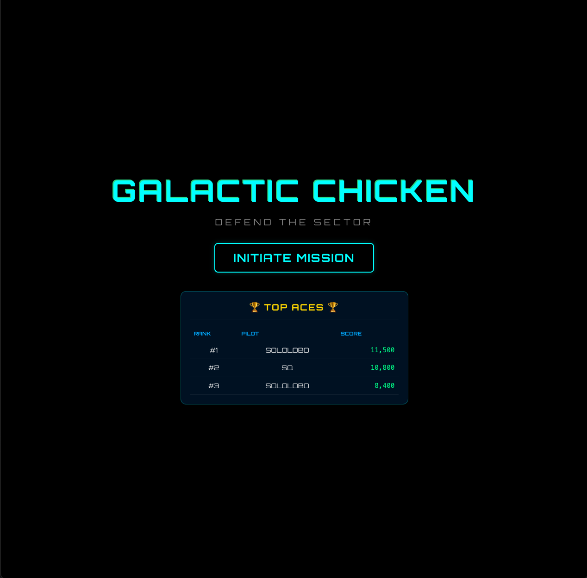
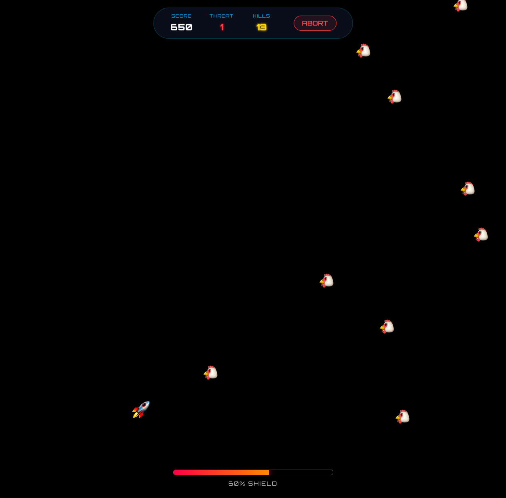
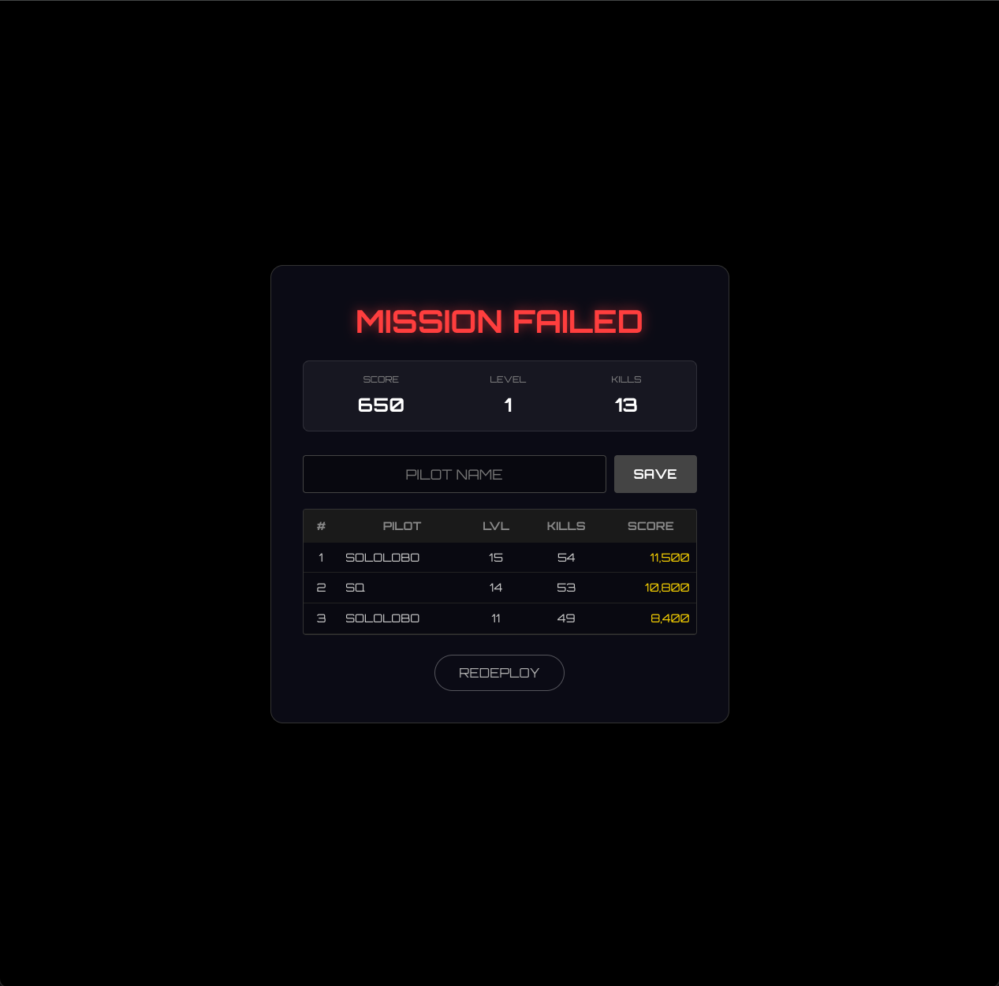

# 🚀 GALACTIC CHICKEN

> **DEFEND THE SECTOR. CLIMB THE RANKS.**



<div align="center">

   

</div>

## 🛸 Mission Briefing

**Galactic Chicken** is a high-octane, neon-soaked arcade shooter built with a modern web stack. Pilot your starship through infinite waves of interstellar poultry, upgrade your weaponry, and immortalize your name on the global leaderboard.

Built with **React** (Canvas API) for smooth 60FPS rendering and **FastAPI** for a high-performance backend.

---

## 📸 Flight Recorder

### ⚔️ Intense Bullet-Hell Action
Fluid mouse-based movement, dynamic hitboxes, and particle explosions.


### 🏆 Global Leaderboard System
Compete for the top spot. Scores, kills, and levels are persisted permanently via a REST API.


---

## ⚡ System Features

*   **🕹️ Arcade Physics:** Smooth "follow-cursor" movement with inertia.
*   **🔥 Dynamic Difficulty:** Enemies spawn faster and shoot back as your **Threat Level** increases.
*   **💪 Power-Up System:** Unlock **Double Blasters** (Lvl 2) and **Triple Threat** (Lvl 4).
*   **✨ Neon Aesthetics:** Custom CSS glassmorphism, glowing HUDs, and "Orbitron" typography.
*   **💾 Persistent Data:** SQLite database tracks every pilot's career high scores.
*   **📱 Responsive:** Automatically adjusts canvas size to fit any viewport.

---

## 🛠️ Deployment Protocols

### Prerequisites
*   Node.js & npm
*   Python 3.8+
*   `uv` (Python package manager) - *Optional but recommended*

### 1. Backend Setup (Mission Control)
The backend handles the database and leaderboard API.

```bash
cd backend

# Install dependencies using uv
uv sync

# Run the server (accessible via local network)
uv run uvicorn main:app --reload --host 0.0.0.0 --port 8000
```

### 2. Frontend Setup (Cockpit)
The frontend is the game client built with React.

```bash
cd frontend

# Install packages
npm install

# Launch the game
npm run dev
```

Open your browser to the link provided by Vite (usually http://localhost:5173 or your Network IP).

---

## 🎮 Flight Manual

| Control | Action |
|---------|--------|
| Mouse | Pilot Ship (Follows cursor) |
| Left Click (Hold) | Fire Weapons |
| Button: Abort | Emergency Exit (Saves current score) |

---

## 📁 Project Structure

chicken-shooter/
├── backend/           # FastAPI Server
│   ├── main.py        # API Endpoints
│   ├── models.py      # SQLAlchemy Database Models
│   ├── database.py    # SQLite Connection
│   └── leaderboard.db # Generated on runtime
│
└── frontend/          # React Client
    ├── src/
    │   ├── GameCanvas.jsx  # Main Game Engine (Canvas API)
    │   ├── Leaderboard.jsx # API Integration & UI
    │   └── App.css         # Neon/Glass Styling
    └── package.json


## 🛰️ Join the Fleet

Ready to upgrade the ship's systems? We welcome all pilots to contribute to the Galactic Chicken project!

### 🚀 Deployment Protocol

1. **Fork the Repository** - Clone your own copy of the mothership
2. **Create Feature Branch** - `git checkout -b feature/new-weapon-system`
3. **Commit Your Changes** - Document your engineering modifications
4. **Push to Branch** - Transmit your updates to the fleet
5. **Open Pull Request** - Request clearance for docking with the main vessel

### 🎯 Mission Objectives
Looking for ways to contribute? Here are some key areas:
- **Weapon Systems**: New power-ups and attack patterns
- **Enemy AI**: Smarter chicken flight patterns and behaviors  
- **Visual Enhancements**: Particle effects, animations, and UI improvements
- **Performance Optimization**: Boost FPS and reduce latency
- **Multiplayer Support**: Co-op and competitive modes

*All contributions must pass our flight readiness review before deployment!*
<div align="center">
<sub>Built with 🐔 by S0L0L0B0</sub>
</div>